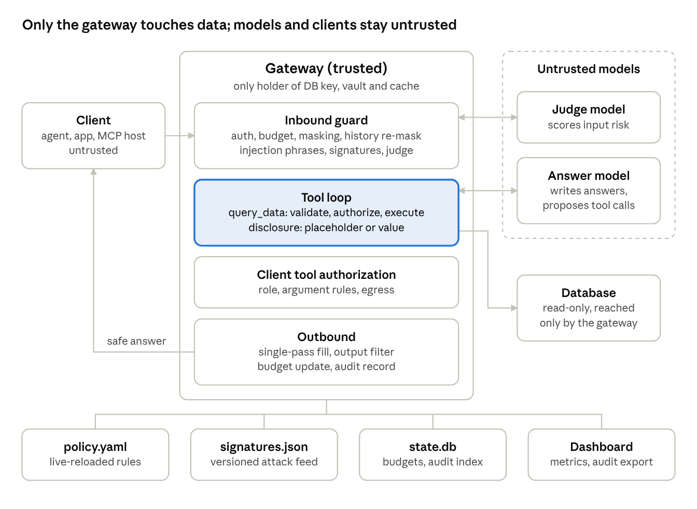

# 3. Architecture and trust boundaries

The gateway is the only trusted component. It alone holds database credentials, the vault
and the issued-value cache. Clients and models are untrusted, local or external.

*architecture · trusted gateway with four stages, untrusted client and models, gateway-only database*

The highlighted tool loop is where deferred binding happens: the model proposes SQL,
the gateway runs it and decides whether the model sees the value or only a placeholder.

The client talks only to the gateway, exactly as it would talk to an LLM provider. The
answer model receives sanitized messages, the client's tool definitions and the built-in
`query_data` tool. It never connects to the database. Client tool calls go back to the client
only after authorization; the client executes them and sends the results in its next
request, where they are scanned like any other input.

## Components

| Component | Trust | Responsibility |
| --- | --- | --- |
| Client (demo agent or any agent) | Untrusted | Sends messages and its own tools with the user's API key; executes its own tools |
| Gateway | Trusted | Runs the whole pipeline; only holder of DB credentials, vault and issued-value cache |
| Answer model | Untrusted | Writes answers and proposes tool calls, including `query_data` |
| Judge model | Untrusted, local only | Scores input risk; output parsed as a number, never followed |
| Database | Trusted, gateway only | Demo data (`products`, `employees`, `salaries`), opened read-only |
| `policy.yaml` | Trusted config | Controls, roles, tools, labels, budgets, models |
| `signatures.json` | Trusted feed | Versioned attack patterns, swappable at runtime |
| `state.db` | Trusted, gateway only | Budget counters and audit index; survives restarts |
| Dashboard | Internal | Reads metrics and audit log; shows the effective policy |

**Deployment at the hackathon.** One laptop: Ollama on `localhost:11434`, gateway on
`localhost:8000`, dashboard on `localhost:8501`, demo agent as a local app. The
gateway calls Ollama through its OpenAI-compatible endpoint, so local and external
models share one adapter.

**Deployment in production (requirement, not demonstrated).** The gateway runs in a
container inside the company network. Network rules ensure that models and clients
have no path to the database; only the gateway's service account holds credentials. On
one laptop with SQLite this is trivially true, so we state it as a requirement rather than
claim it as proven.
