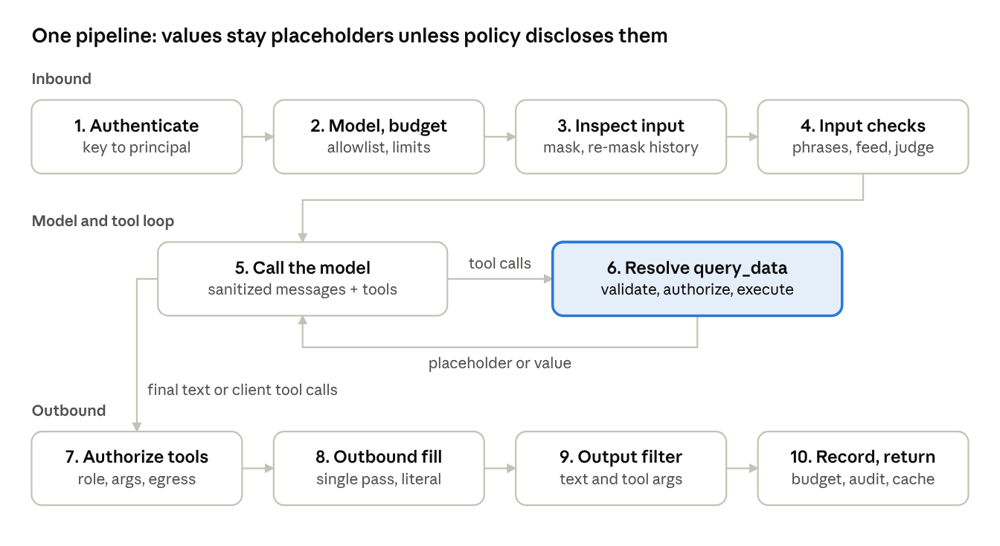

# 4. Request pipeline

Every request follows one pipeline with ten steps in three phases: inbound, model and
tool loop, outbound. There are no modes; the AI data policy only decides what a
`query_data` result shows the model. Cheap deterministic checks run first, so blocked
requests stop before any model call.

*request pipeline · 10 steps in 3 phases, one bounded tool loop*

Any check that blocks stops the request at that step, writes the audit record and returns
the reason as an assistant message.

## Inbound

1. **Authenticate.** Resolve the API key to a principal (user, role, department, AI data
   policy). Unknown key: block. Snapshot the current policy version for this request.
2. **Model and budget pre-check.** The requested `model` must be in `models.allowed`, else
   block or substitute per `models.on_unlisted`. Check tokens per day, requests per
   minute and cost per day. Exhausted: block before any model call.
3. **Inbound inspection.** Applies to every untrusted part of the request:
   - a. User messages: detect secrets and PII deterministically; each match becomes a
      mask token and the original goes to the vault.
   - b. Tool result messages (output of client tools from the previous turn): masked the
      same way and marked as untrusted content.
   - c. Assistant messages in history: **history re-masking** replaces values from the issued-value cache with `[PRIOR_VALUE]`.
   - d. Client tool definitions: names and descriptions are scanned for injection and
      signatures (tool poisoning).
4. **Input checks.** Match the sanitized content against injection phrases and the signature
   feed. If those pass, run the judge model on the newest user message and new tool
   results. Score at or above threshold: block. Identity claims ("I am HR") are logged as
   suspicious and never change the principal.

## Model and tool loop

5. **Call the model** with: a gateway system message (database schema as table and
   column names only, placeholder rules), the sanitized messages, the client's tools and
   the built-in `query_data` tool. Every call sets `max_tokens`. Budget is re-checked before
   each call.
6. **Tool loop.** While the model's response contains `query_data` calls:
   - a. For each call, create a binding with the next placeholder (`{x1}`, `{x2}`, ...).
   - b. Validate the SQL, authorize it, execute it (section 5). Outcome: `resolved`, `denied`,
      `rejected`, `empty` or `error`.
   - c. Return a tool result to the model. By default it is the placeholder only. The real value
      is disclosed only if the disclosure rule (section 5) allows it.
   - d. Call the model again. Stop when it returns final text or client tool calls, or when
      `max_tool_iterations` is reached; then one last call runs with tools disabled.
   - e. Mixed turn: if one response contains both `query_data` and client tool calls, the
      gateway resolves the `query_data` calls, answers each client call with a synthetic
      "not executed, re-issue if still needed" result, and calls the model again.

## Outbound

7. **Client tool authorization.** For each proposed client tool call: is the tool allowed for the
   role, do the arguments pass the argument rules, and do the arguments contain
   placeholders that may not leave (egress rule, section 5)? Denied calls are removed
   from the response and audited. If every call is removed, the client receives a text
   message naming the blocked action.
8. **Outbound fill.** Replace placeholders in the final text in a single, literal pass: resolved
   values or markers. Inserted values are never re-scanned for placeholders. The user's
   own mask tokens are restored from the vault only if `echo_own_input` allows it.
9. **Output filter.** Runs on every answer and on allowed tool-call arguments. Model-written
   text is checked for secrets, PII the user may not see, guessed protected values and
   unbound placeholders. Gateway-inserted values are authorized by construction and
   only escaped. Redact or block per policy.
10. **Record and return.** Update budgets from actual token usage of every model and judge
    call. Record hidden values inserted in this answer in the issued-value cache. Write one
    audit record. Return an OpenAI-format response.

## Worked examples

**A. Hidden values (default).** Anna, intern, policy `deny`, asks: "What is my salary and what
does the CEO earn?" The model calls `query_data` twice. `x1` filters on `:current_user`
and is resolved; `x2` filters on another employee and is denied. Both calls return only `{x1}`
and `{x2}`, so the model cannot tell them apart. It writes "Your salary is {x1} PLN. The CEO
earns {x2} PLN." Anna receives "Your salary is 6,200 PLN. The CEO earns [UNAVAILABLE]
PLN." The model never saw 6,200 or learned that `x2` was denied.

**B. Mixed disclosure.** Piotr, HR manager, policy `allow`, label limit `internal`, asks: "How
many people work in sales, and what is their average salary?" The headcount comes from
`employees` (internal) and is disclosed to the model. The average comes from `salaries`
(sensitive) and stays a placeholder. The model writes "Sales has 12 people; their average
salary is {x2} PLN." The gateway fills `{x2}`.

**C. Governed agency.** Anna's agent offers a `send_email` tool. The model proposes an
email to an external address. The argument rule allows only company-domain recipients,
so the call is removed and audited. Anna's agent receives "The action send_email was
blocked by policy."

**D. Next turn.** Anna asks a follow-up. Her client sends the history, which now contains
"6,200". History re-masking replaces it with `[PRIOR_VALUE]` before the model sees it.

## Judge model hardening

The judge receives the content inside clear delimiters and must reply with JSON
`{"risk": <0..1>}`. The gateway parses only the number; any other output counts as a
judge failure and follows `semantic.on_failure`. Candidate models: `qwen2.5:1.5b`
(general) and `llama-guard3:1b` (harmful content), chosen in the hour-1 test.
